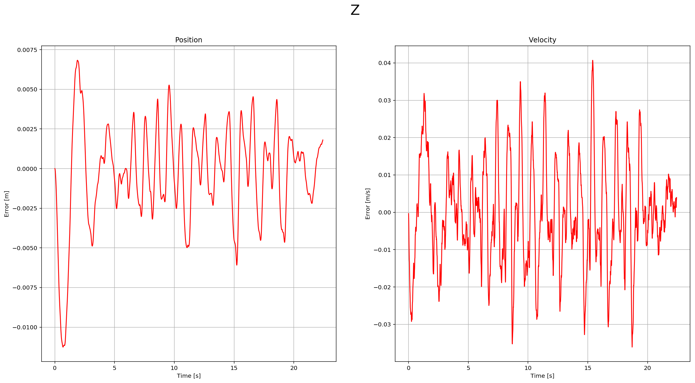
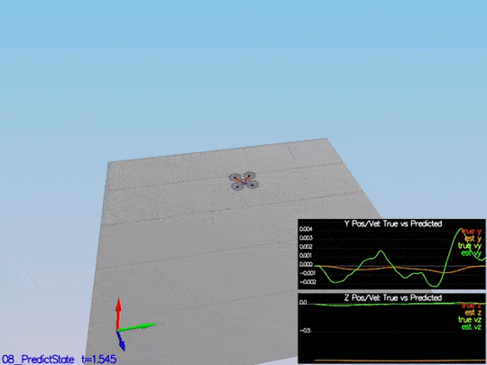
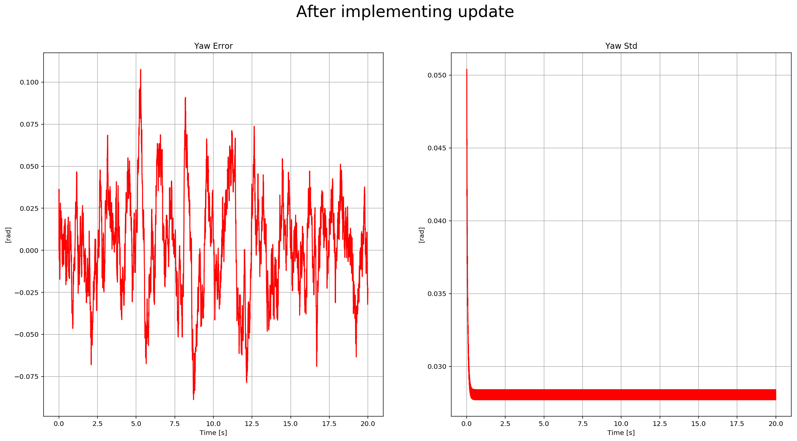
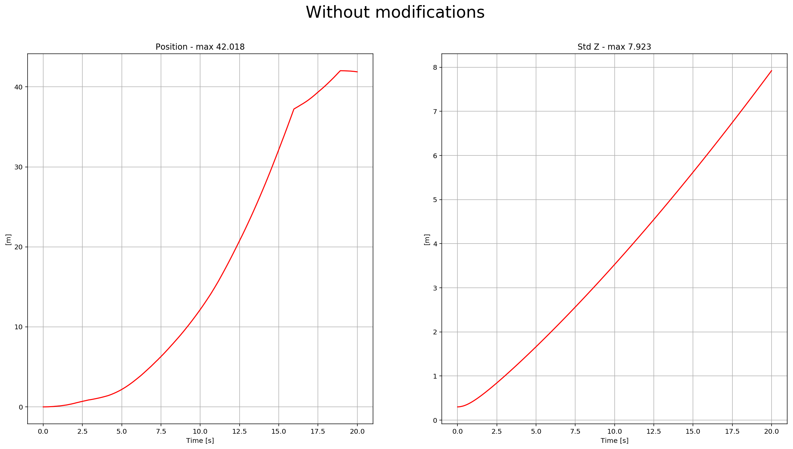
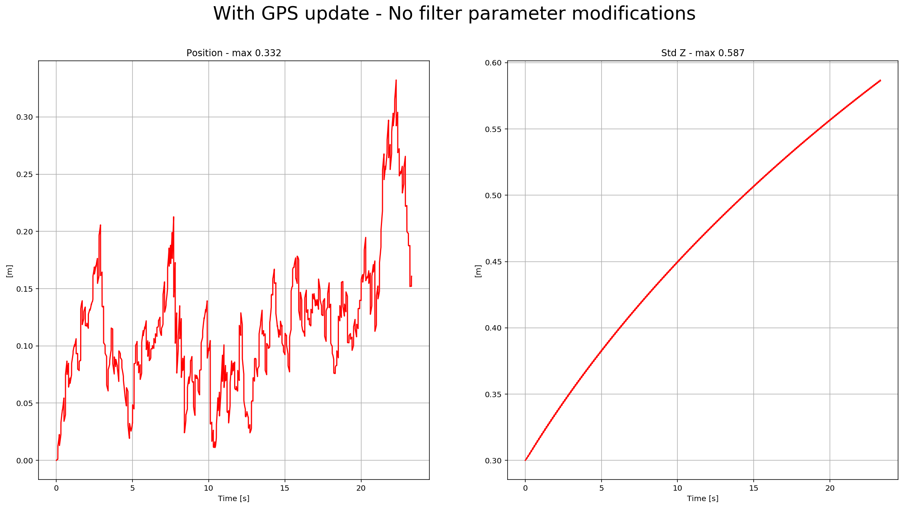
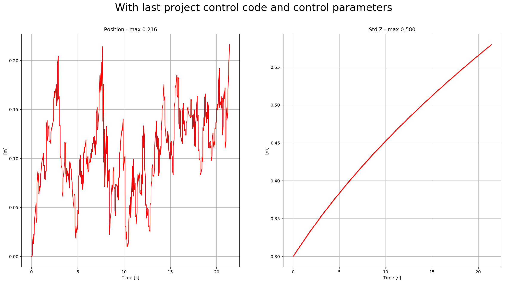

# Building an Estimator
## Step 1: Sensor noise

It is step 1 here, but this code contains all the code from the control project as well; so, it is scenario `06_SensorNoise`. The simulator will generate two files with GPS and IMU measurements. The task is to process those files and calculate the standard deviation(sigma) for those sensors.


Following is the o/p of this test,

```
PASS: ABS(Quad.GPS.X-Quad.Pos.X) was less than MeasuredStdDev_GPSPosXY for 67% of the time
PASS: ABS(Quad.IMU.AX-0.000000) was less than MeasuredStdDev_AccelXY for 69% of the time
```

## Step 2: Attitude Estimation

In this step, we need to include information from the IMU to the state. There is a few code provided by us there. The only thing we need to do is to integrate `pqr` from the gyroscope into the estimated pitch and roll. The implementation provided linear. The following figure illustrates the data we get with that implementation:


We need to implement a non-linear one to get better results. First, we need to find the roll, pitch and yaw derivates using the following equation from the control lectures:


Once we have the derivates, we can multiply them by `dt` to approximate the integral. The following is a more detail graph after the non-linear integration:


And here is a video of the scenario:


Following is the o/p of this test,

```
PASS: ABS(Quad.Est.E.MaxEuler) was less than 0.100000 for at least 3.000000 seconds
```

## Step 3: Prediction Step

This step has two parts. In the first part, we predict the state based on the acceleration measurement. Without modifying the code, we have this data:



After implementing the first part, you can see the estimation drift:


This is a scenario video:



The second part we update the covariance matrix and finish the EKF state using the equations on the Estimation for Quadrotors.


The red-dotted line represents the sigma, and it is not changing over time. After the update of the covariance matrix:


There the dotted line is growing showing sigma growing over time due to the prediction step. Here is a scenario video:


## Step 4: Magnetometer Update

In this step, we need to update the state with the magnetometer measurement. Without code modifications, we have this data:


To implement the update, we need to use the equations from section `7.3.2 Magnetometer` from the [Estimation for Quadrotors](https://www.overleaf.com/read/vymfngphcccj#/54894644/) paper. After it is implemented, we received this data:



You can see there the yaw error decrease, and the sigma remained stable. Here is a scenario video:


Following is the o/p of this test,

```
PASS: ABS(Quad.Est.E.Yaw) was less than 0.120000 for at least 10.000000 seconds
PASS: ABS(Quad.Est.E.Yaw-0.000000) was less than Quad.Est.S.Yaw for 67% of the time
```

## Step 5: Closed Loop + GPS Update

The last step before to finish the EKF implementation: GPS Update. After eliminating the ideal estimator of the code without any code modification, we have this data:



The drone goes wild from time to time as well:


This video is [scenario5-wild.mov](./videos/scenario4-wild.mov).

To implement this update, we need to use the equations from section `7.3.1 GPS` from the [Estimation for Quadrotors](https://www.overleaf.com/read/vymfngphcccj#/54894644/) paper. After it is implemented, we received this data:



We can see there the position error, and sigma decreased. Here is a scenario video:


Following is the o/p of this test,

```
PASS: ABS(Quad.Est.E.Pos) was less than 1.000000 for at least 20.000000 seconds
```

## Step 6: Adding Your Controller

The last step! You need to put the control and parameters from the last project and see how it behaves in a noisy scenario. I was lucky enough not to have to tune the control again. I guess the control parameters were "relaxed" already. After adding both files, we received this data:



Here is a scenario video:


When the scenario is passing the test, you should see this line on the standard output:

```
PASS: ABS(Quad.Est.E.Pos) was less than 1.000000 for at least 20.000000 seconds
```
